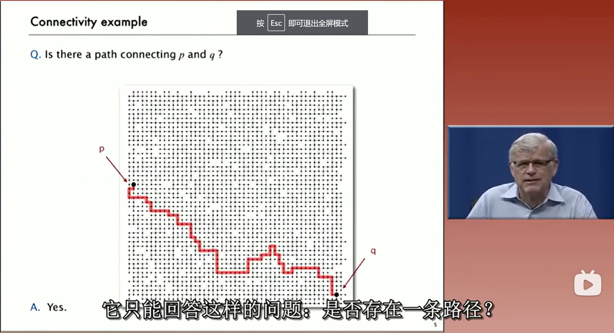
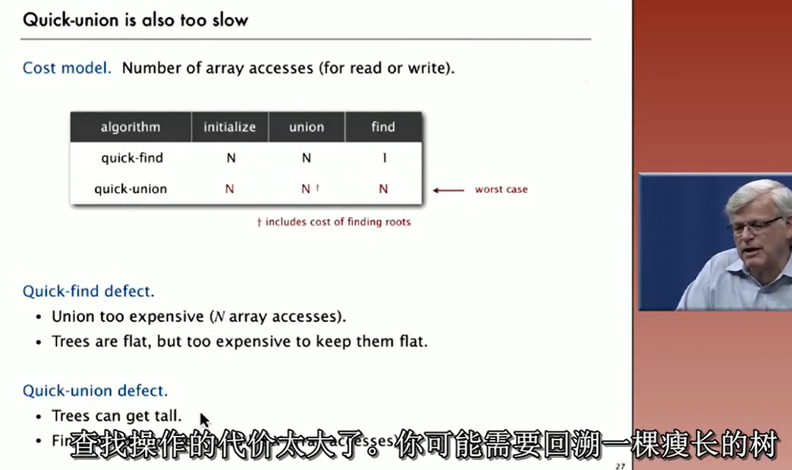

## 视频-Dynamic Connectivity  

- 这个算法只能回答这样的问题：是否存在一条路径？  

  

## 视频-Quick Find  

算法分析：只是判断它们是否连通就需要正比于N的平方的时间。因为**平方量级的时间太慢了，对于大型问题我们不能接受需要平方时间的算法。**  

## 视频-Quick Union  

算法分析：相对于快速查找算法它是另一种慢，就是查找操作的代价太大了。  

  

## 视频-Quick-Union Improvements  

## 视频-Union−Find Applications  

## 总结  

我们选取了一个重要的问题——动态连通性问题，我们通过对问题建模试图精确理解我们需要什么样的数据结构和算法解决它。然后我们先提出了几个可以解决问题的算法，并很快发现它们不足以处理巨大问题。但之后我们发现了如何改进它们，得到了高效的算法。最后我们遇到了必须使用高效算法才能解决的应用问题。整个流程涉及科学方法，算法设计中我们试图构建数学模型帮助我们，理解我们要设计的算法的性质，之后我们通过实验，在模型上进行测试，使得我们能够不断改进算法，迭代开发更好的算法和更精致的模型，直到得到用来解决我们感兴趣的实际问题所需要的算法，这将会是我们这门课中将要用来学习算法的整体框架。

